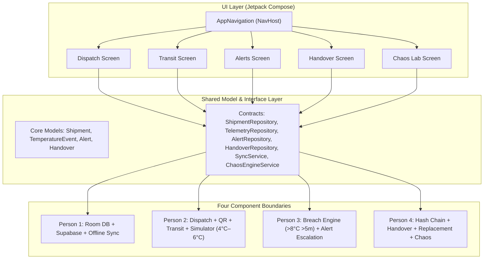

# ColdChainHandshake — System Architecture (MVP)

## 1. Executive Summary
**ColdChainHandshake** is a native Android application designed to secure pharmaceutical and biologic cold-chain logistics. It combines local offline data persistence, automated temperature excursion detection, cryptographic hash-chain verification, and a two-party custody handover inspection process.

---

## 2. High-Level Architecture Diagram

---

## 3. Core Architectural Principles

### 3.1 Strict Separation of Concerns
- **UI Layer (`ui/`)**: Pure Jetpack Compose with reactive state observation via Kotlin Flows.
- **Contract Layer (`models/` & `repository/`)**: Shared interfaces and data models acting as the single source of truth across all components.
- **Component Layer**: Four discrete modules implemented against the shared contracts without redefining models.

### 3.2 Canonical Data Models
- **`Shipment`**: Consignment metadata (`id`, `qrCode`, `loggerId`, `origin`, `destination`, `workerId`, `status`).
- **`TemperatureEvent`**: Environmental telemetry point (`id`, `shipmentId`, `loggerId`, `timestamp`, `temperature`, `previousHash`, `currentHash`, `syncStatus`).
- **`Alert`**: Thermal breach or system warning (`id`, `shipmentId`, `type`, `message`, `timestamp`, `escalationLevel`, `acknowledged`).
- **`Handover`**: Inspection and sign-off record (`id`, `shipmentId`, `workerSigned`, `pharmacistSigned`, `integrityVerified`, `temperaturePassed`, `verdict`, `timestamp`).

### 3.3 Business Rules Baseline
- **Safe Range**: 2°C–8°C inclusive.
- **Simulator Normal**: 4°C–6°C.
- **Heat Spike**: 9°C–11°C.
- **Temperature Breach**: Temperature strictly $> 8^\circ\text{C}$ AND cumulative duration strictly $> 5\text{ minutes}$.

### 3.4 Cryptographic Hash Chain
Each `TemperatureEvent` contains `previousHash` and `currentHash`. The hash chain ensures that historical telemetry cannot be altered without invalidating the chain during handover inspection.

### 3.5 Reference Repositories Isolation
- `reference/novumlogic/` and `reference/nuekkis/` are strictly read-only reference material.
- Excluded from `settings.gradle` and never compiled as modules.
